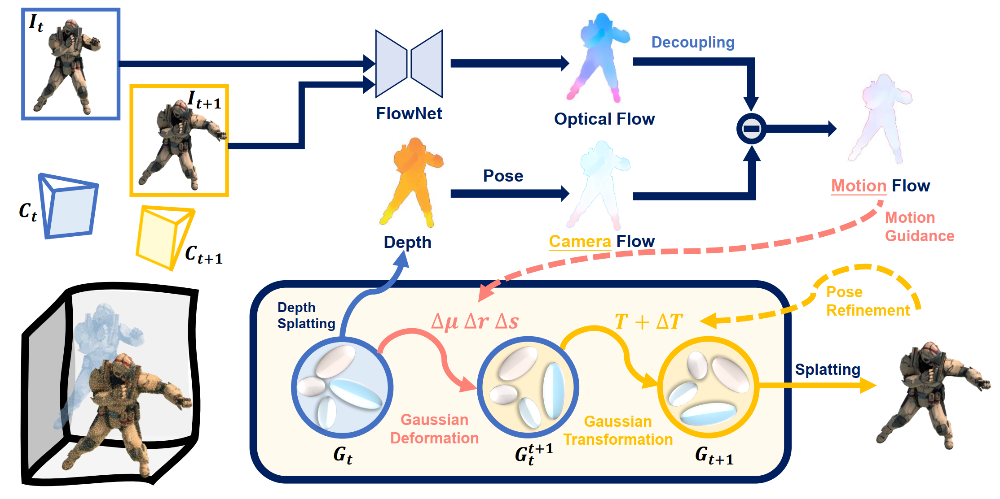

<h3 align="center"><strong>MotionGS: Exploring Explicit Motion Guidance for Deformable 3D Gaussian Splatting</strong></h3>

  <p align="center">
    <a href="https://ruijiezhu94.github.io/ruijiezhu/">Ruijie Zhu*</a>,
    <a href="https://rosetta-leong.github.io/">Yanzhe Liang*</a>,
    <a href="">Hanzhi Chang</a>,
    <a href="">Jiacheng Deng</a>,
    <a href="">Jiahao Lu</a>, 
    <br>
    <a href="">Wenfei Yang</a>,
    <a href="http://staff.ustc.edu.cn/~tzzhang/">Tianzhu Zhang</a>,
    <a href="https://dblp.org/pid/z/YongdongZhang.html">Yongdong Zhang</a>
    <br>
    *Equal Contribution.
    <br>
    University of Science and Technology of China
    <br>
    <b>NeurIPS 2024</b>

</p>

<div align="center">
 <a href='https://arxiv.org/abs/2410.07707'></a> &nbsp;&nbsp;&nbsp;&nbsp;&nbsp;
<!-- <a href='https://arxiv.org/abs/[]'></a> &nbsp;&nbsp;&nbsp;&nbsp;&nbsp; -->
 <a href='https://ruijiezhu94.github.io/MotionGS_page/'></a> &nbsp;&nbsp;&nbsp;&nbsp;&nbsp;
 <a href='https://github.com/RuijieZhu94/MotionGS?tab=MIT-1-ov-file'></a> &nbsp;&nbsp;&nbsp;&nbsp;&nbsp;
 <a href='https://ruijiezhu94.github.io/MotionGS'></a>
</div>


<p align="center">

</p>

> The overall architecture of MotionGS. It can be viewed as two data streams: (1) The 2D data stream utilizes the optical flow decoupling module to obtain the motion flow as the 2D motion prior; (2) The 3D data stream involves the deformation and transformation of Gaussians to render the image for the next frame. During training, we alternately optimize 3DGS and camera poses through the camera pose refinement module.

## TODO
- [ ] Release the video demo
- [ ] Release the **MotionGS** code (Full code might be released after the CVPR deadline, stay tuned!)


## Bibtex

If you find our work useful in your research, please consider citing:

```
@article{zhu2024motiongs,
  title={MotionGS: Exploring Explicit Motion Guidance for Deformable 3D Gaussian Splatting},
  author={Zhu, Ruijie and Liang, Yanzhe and Chang, Hanzhi and Deng, Jiacheng and Lu, Jiahao and Yang, Wenfei and Zhang, Tianzhu and Zhang, Yongdong},
  journal={arXiv preprint arXiv:2410.07707},
  year={2024}
}
```
